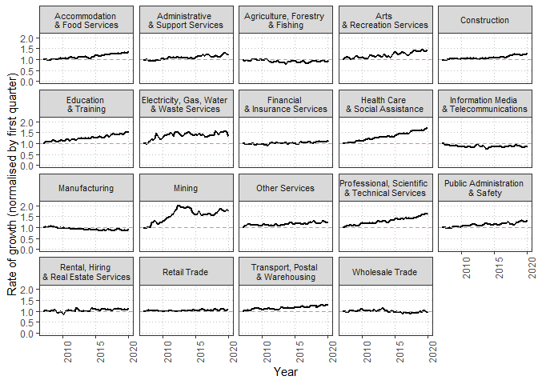
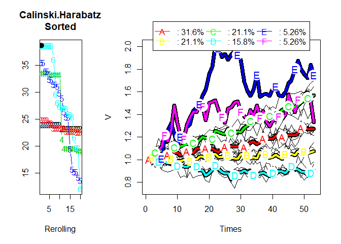

Analysis of 2020-1980 ABS industries by sub-division and sex (Table 6)
================
Erika Duan
2020-08-16

  - [Dataset background](#dataset-background)
  - [Explore overall employment changes by main
    industry](#explore-overall-employment-changes-by-main-industry)
  - [Explore rate of employment growth or decline rate since the global
    financial
    crisis](#explore-rate-of-employment-growth-or-decline-rate-since-the-global-financial-crisis)
  - [Explore employment rate change between 2020-02 and 2020-05 (the
    COVID-19
    quarter)](#explore-employment-rate-change-between-2020-02-and-2020-05-the-covid-19-quarter)
      - [Document the number of employed persons per industry in Feb
        2020](#document-the-number-of-employed-persons-per-industry-in-feb-2020)
      - [Explore whether a gender disparity due to COVID-19
        impact](#explore-whether-a-gender-disparity-due-to-covid-19-impact)
  - [Combined analysis](#combined-analysis)
  - [Policy impact](#policy-impact)
      - [How can we help identify and assist people in industries most
        affected by
        COVID-19?](#how-can-we-help-identify-and-assist-people-in-industries-most-affected-by-covid-19)

# Dataset background

The **Employed persons by Industry sub-division of main job (ANZSIC) and
Sex** dataset used for analysis can be found from
[here](https://beta.abs.gov.au/statistics/labour/employment-and-unemployment/labour-force-australia-detailed/latest-release#industry-occupation-and-sector),
where it is listed as Table 6.

Sheets of interest:

  - All data sheets with prefix “Data”.  
  - Data sheets contain counts of employed persons by industry
    sub-division of main job (ANZSIC) and sex, and is updated quarterly,
    including before Covid-19 industry impact (quarter = 2020-05).

<!-- end list -->

``` r
# check main_industry levels   
unique(tidy_labour$main_industry)   
```

    ##  [1] "Agriculture, Forestry and Fishing"              
    ##  [2] "Mining"                                         
    ##  [3] "Manufacturing"                                  
    ##  [4] "Electricity, Gas, Water and Waste Services"     
    ##  [5] "Construction"                                   
    ##  [6] "Wholesale Trade"                                
    ##  [7] "Retail Trade"                                   
    ##  [8] "Accommodation and Food Services"                
    ##  [9] "Transport, Postal and Warehousing"              
    ## [10] "Information Media and Telecommunications"       
    ## [11] "Financial and Insurance Services"               
    ## [12] "Rental, Hiring and Real Estate Services"        
    ## [13] "Professional, Scientific and Technical Services"
    ## [14] "Administrative and Support Services"            
    ## [15] "Public Administration and Safety"               
    ## [16] "Education and Training"                         
    ## [17] "Health Care and Social Assistance"              
    ## [18] "Arts and Recreation Services"                   
    ## [19] "Other Services"

``` r
# check tidy_labour structure
str(tidy_labour)   
```

    ## Classes 'tbl_df', 'tbl' and 'data.frame':    160160 obs. of  6 variables:
    ##  $ date         : Date, format: "1984-11-01" "1984-11-01" ...
    ##  $ count        : num  411 310 101 339 290 ...
    ##  $ main_industry: chr  "Agriculture, Forestry and Fishing" "Agriculture, Forestry and Fishing" "Agriculture, Forestry and Fishing" "Agriculture, Forestry and Fishing" ...
    ##  $ sub_industry : chr  "None" "None" "None" "None" ...
    ##  $ gender       : chr  "total" "males" "females" "total" ...
    ##  $ employ_type  : chr  "total" "total" "total" "full-time" ...

# Explore overall employment changes by main industry

Let’s first examine the historical rate of employment growth or decline
per industry.  
We can do this by filtering for the total employed persons count per
industry (i.e. by filtering away rows of counts for all sub-industries,
and by filtering on counts where `gender == "total"` and `employ_type ==
"total"`).


# Explore rate of employment growth or decline rate since the global financial crisis

We can then examine how the employment rate in each industy has fared
since the global financial crisis but before the onset of COVID-19, to
get an ideal of recent growth versus declines per industry.  
This would affect our policy decisions about whether an industry can be
boosted, or reskilling for current workers may be required as the
industry declines for broader economic reasons.

Let’s examine how the employment rate in each industry has grown or
declined with `2017-02` as our starting quarter (i.e. the year of the
global financial crisis) and `2020-05` as our last quarter.



We can categorise industries by how similar their rate of employment
growth or decline has been since February 2007 to February 2020, by
conducting longitudinal k-means clustering by main industry (i.e. the
time series of each industry represents a single individual’s
trajectory). We can do this using the `kml` package and optimise for
`k`.

<!-- --><!-- -->

We can then categorise different industries by how they have behaved
since the global financial crisis but before COVID-19.

<!-- -->

# Explore employment rate change between 2020-02 and 2020-05 (the COVID-19 quarter)

Another aspect we would be interested in examining is specifically how
each industry’s employment rate has changed since the onset of COVID-19.
From our dataset, we can take this period to be between 2020-02 (the
onset of COVID-19 cases reported from overseas) and 2020-05 (COVID-19
impacts already felt within Australia).

    ##         0%        20%        40%        60%        80%       100% 
    ## -36.454527 -11.818653  -5.511917  -3.920287   2.442521  23.833658

<!-- -->

## Document the number of employed persons per industry in Feb 2020

Since our descriptions of industry change have relied on relative
metrics (i.e. normalised rates of growth or decline in employment
numbers), it is important to also describe industries by the number of
employed persons per industry. This way, we can also classify industries
as small, medium or large sized industries (ideally, the ABS would
already have an industry classification system for employment size).

    ##        0%       20%       40%       60%       80%      100% 
    ##  136.1060  246.5368  454.8381  796.1151 1126.7047 1798.3282

| main\_industry                                  | count\_summary     |
| :---------------------------------------------- | :----------------- |
| Agriculture, Forestry and Fishing               | 250-500 thousand   |
| Mining                                          | 100-250 thousand   |
| Manufacturing                                   | 500-1000 thousand  |
| Electricity, Gas, Water and Waste Services      | 100-250 thousand   |
| Construction                                    | Over 1000 thousand |
| Wholesale Trade                                 | 250-500 thousand   |
| Retail Trade                                    | Over 1000 thousand |
| Accommodation and Food Services                 | 500-1000 thousand  |
| Transport, Postal and Warehousing               | 500-1000 thousand  |
| Information Media and Telecommunications        | 100-250 thousand   |
| Financial and Insurance Services                | 250-500 thousand   |
| Rental, Hiring and Real Estate Services         | 100-250 thousand   |
| Professional, Scientific and Technical Services | Over 1000 thousand |
| Administrative and Support Services             | 250-500 thousand   |
| Public Administration and Safety                | 500-1000 thousand  |
| Education and Training                          | Over 1000 thousand |
| Health Care and Social Assistance               | Over 1000 thousand |
| Arts and Recreation Services                    | 250-500 thousand   |
| Other Services                                  | 250-500 thousand   |

## Explore whether a gender disparity due to COVID-19 impact

A gender disparity metric can include whether there is a:

  - Greater decrease in female compared to male workers.  
  - Modest decrease in female compared to male workers.
  - Minimal gender disparity.  
  - Modest decrease in male compared to female workers.  
  - Greater decreased in male compared to female workers.

since gender is strongly associated with the industry of employment, it
may be useful to calculate the ratio of female to male employed persons
per industry first.  
We can then visualise whether there has been a change in this rate
between 2020-02 and 2020-05.

    ##           0%          20%          40%          60%          80% 
    ## -0.123792050 -0.041889848 -0.012146214  0.007778083  0.046533246 
    ##         100% 
    ##  0.124287288


# Combined analysis

We can combine these different aspects of industry analysis to obtain a
breakdown of how industry vulnerability to COVID-19 looks across
multiple categories.

| main\_industry                                  | growth\_since\_gfc | covid\_diff\_summary | count\_summary     | gender\_ratio\_summary                     |
| :---------------------------------------------- | :----------------- | :------------------- | :----------------- | :----------------------------------------- |
| Agriculture, Forestry and Fishing               | Decline            | 5 to 25% increase    | 250-500 thousand   | Moderate decline in female/males employed  |
| Mining                                          | Unstable growth    | 5 to 0% decline      | 100-250 thousand   | Minimal change in female/males employed    |
| Manufacturing                                   | Decline            | 5 to 0% decline      | 500-1000 thousand  | Minimal change in female/males employed    |
| Electricity, Gas, Water and Waste Services      | Unstable growth    | 5 to 25% increase    | 100-250 thousand   | Moderate increase in female/males employed |
| Construction                                    | Moderate growth    | 5 to 0% decline      | Over 1000 thousand | Minimal change in female/males employed    |
| Wholesale Trade                                 | No growth          | 0 to 5% increase     | 250-500 thousand   | Great increase in female/males employed    |
| Retail Trade                                    | No growth          | 10 to 5% decline     | Over 1000 thousand | Great decline in female/males employed     |
| Accommodation and Food Services                 | Moderate growth    | 40 to 10% decline    | 500-1000 thousand  | Great decline in female/males employed     |
| Transport, Postal and Warehousing               | Moderate growth    | 40 to 10% decline    | 500-1000 thousand  | Minimal change in female/males employed    |
| Information Media and Telecommunications        | Decline            | 40 to 10% decline    | 100-250 thousand   | Great decline in female/males employed     |
| Financial and Insurance Services                | No growth          | 0 to 5% increase     | 250-500 thousand   | Great decline in female/males employed     |
| Rental, Hiring and Real Estate Services         | No growth          | 0 to 5% increase     | 100-250 thousand   | Great increase in female/males employed    |
| Professional, Scientific and Technical Services | High growth        | 10 to 5% decline     | Over 1000 thousand | Minimal change in female/males employed    |
| Administrative and Support Services             | Moderate growth    | 40 to 10% decline    | 250-500 thousand   | Minimal change in female/males employed    |
| Public Administration and Safety                | Moderate growth    | 0 to 5% increase     | 500-1000 thousand  | Great increase in female/males employed    |
| Education and Training                          | High growth        | 10 to 5% decline     | Over 1000 thousand | Great increase in female/males employed    |
| Health Care and Social Assistance               | High growth        | 5 to 0% decline      | Over 1000 thousand | Minimal change in female/males employed    |
| Arts and Recreation Services                    | High growth        | 40 to 10% decline    | 250-500 thousand   | Minimal change in female/males employed    |
| Other Services                                  | Moderate growth    | 40 to 10% decline    | 250-500 thousand   | Moderate decline in female/males employed  |

# Policy impact

## How can we help identify and assist people in industries most affected by COVID-19?

By understanding how different industries are behaving, we can tailor
different methods to help industries affected by COVID-19.

For instance, Accommodation and Food Services has had:

  - Moderate growth since the global financial crisis.  
  - But a 40 to 10% decline in employed workers since COVID19 hit.
  - Whilst being a very large industry in itself (500-1000 thousand
    works employment).
  - With a great decline in the ratio of female/males employed.

This means that we would need examine why more women are losing work, as
well as why all workers are losing work during COVID-19. A silver lining
is that the industry itself has been healthily growing since the global
financial crisis, so we would not need to worry about long term industry
revival solutions, but need to address the COVID-19 related impact
specifically.
