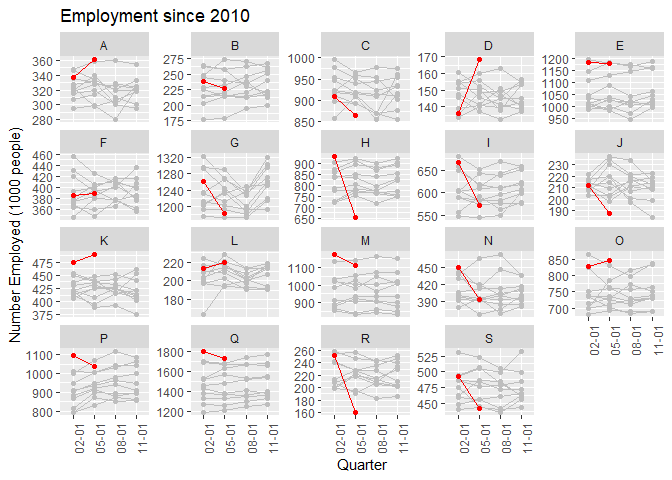

Impact to Industries by COVID-19
================
Elena Tartaglia
15 August 2020

*Challenge: How can we help identify and assist people in industries most affected by COVID-19?*

Investigate which industries have been most impacted by COVID-19.

Plots
-----

Employment numbers

The two hardest hit

Since 2010
----------

Comparison across all industries since 2010. The employment figures for 2020 are in red.

    ##    broad_code                                      broad_name
    ## 1           A               Agriculture, Forestry and Fishing
    ## 2           B                                          Mining
    ## 3           C                                   Manufacturing
    ## 4           D      Electricity, Gas, Water and Waste Services
    ## 5           E                                    Construction
    ## 6           F                                 Wholesale Trade
    ## 7           G                                    Retail Trade
    ## 8           H                 Accommodation and Food Services
    ## 9           I               Transport, Postal and Warehousing
    ## 10          J        Information Media and Telecommunications
    ## 11          K                Financial and Insurance Services
    ## 12          L         Rental, Hiring and Real Estate Services
    ## 13          M Professional, Scientific and Technical Services
    ## 14          N             Administrative and Support Services
    ## 15          O                Public Administration and Safety
    ## 16          P                          Education and Training
    ## 17          Q               Health Care and Social Assistance
    ## 18          R                    Arts and Recreation Services
    ## 19          S                                  Other Services
    ## 20          X                               Other individuals
    ## 21          Z                                           Other

Data Citation
=============

[Table 4: Employed persons by Industry division of main job (ANZSIC)](https://beta.abs.gov.au/statistics/labour/employment-and-unemployment/labour-force-australia-detailed/latest-release#data-download)
